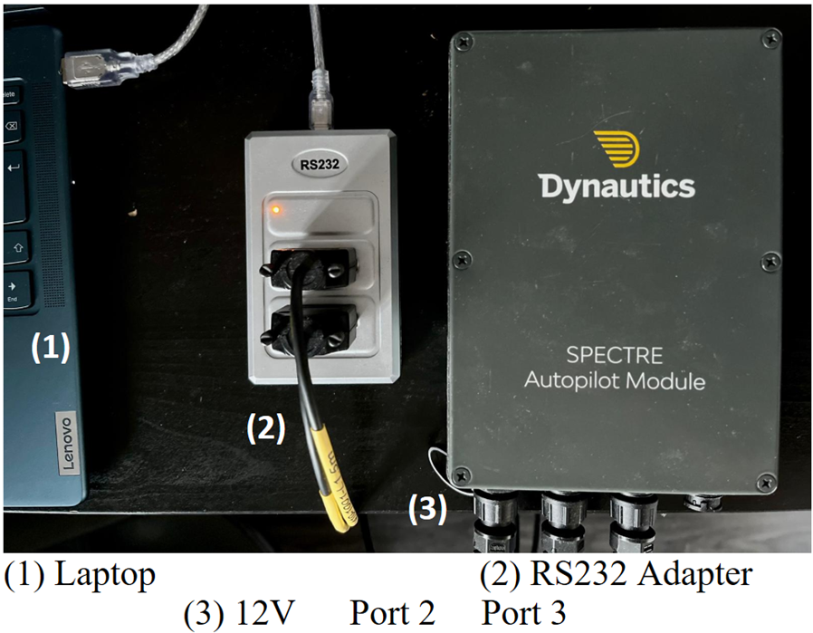
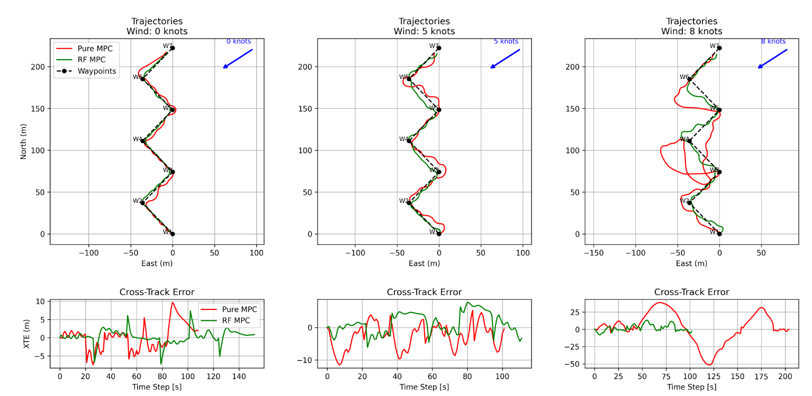

# Improved Waypoint Tracking using Random-Forest Enhanced MPC

For my third-year engineering project, I developed a hybrid algorithm that integrates Random Forest machine learning models with a traditional Model Predictive Controller (MPC). This novel approach enhances real-time state estimation and improves the accuracy and robustness of waypoint tracking in dynamic environments. The Random Forest component is trained on simulated and experimental data using a PID Controller to predict system states and disturbances such as wind with higher precision. These predictions are then fed into the MPC framework to generate optimised control actions that adapt to changing system dynamics and environmental uncertainties. The goal is to bridge the gap between data-driven learning and classical control theory, creating a more intelligent and responsive control system applicable to Unmanned Surface Vessels (USVs).

Setup of the hardware:

  

Below is the results obtained from experimenting the Random-Forest Enhanced MPC

  

